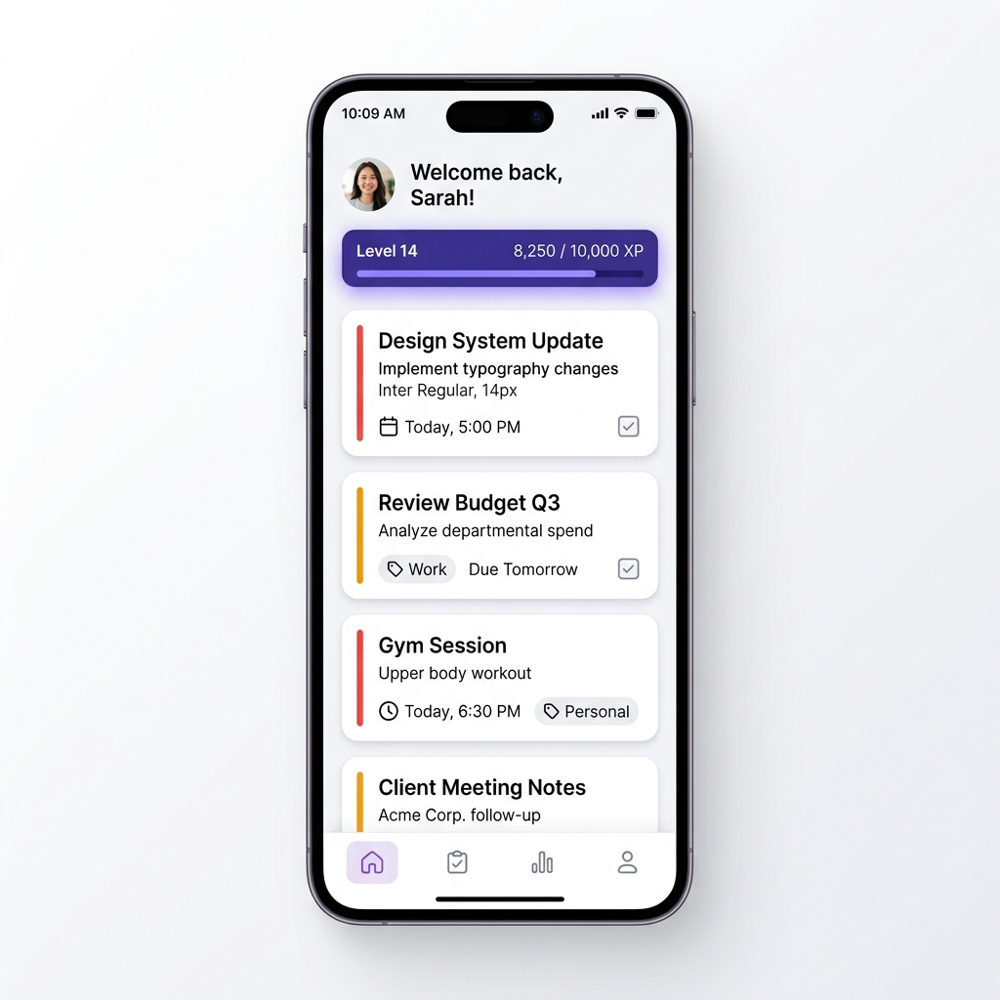
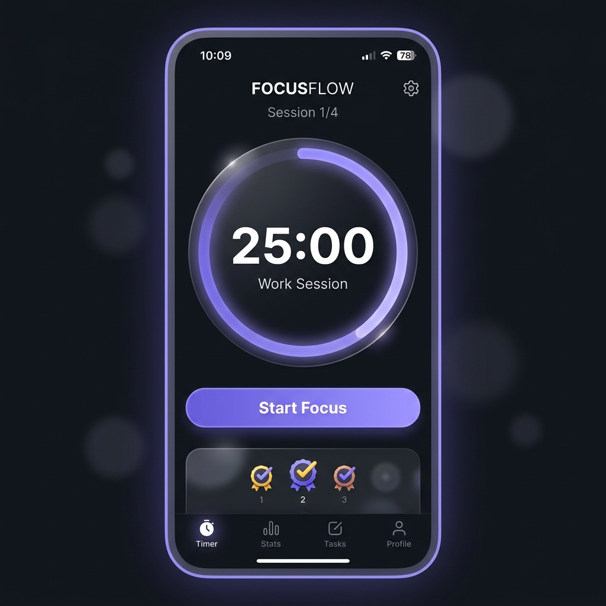
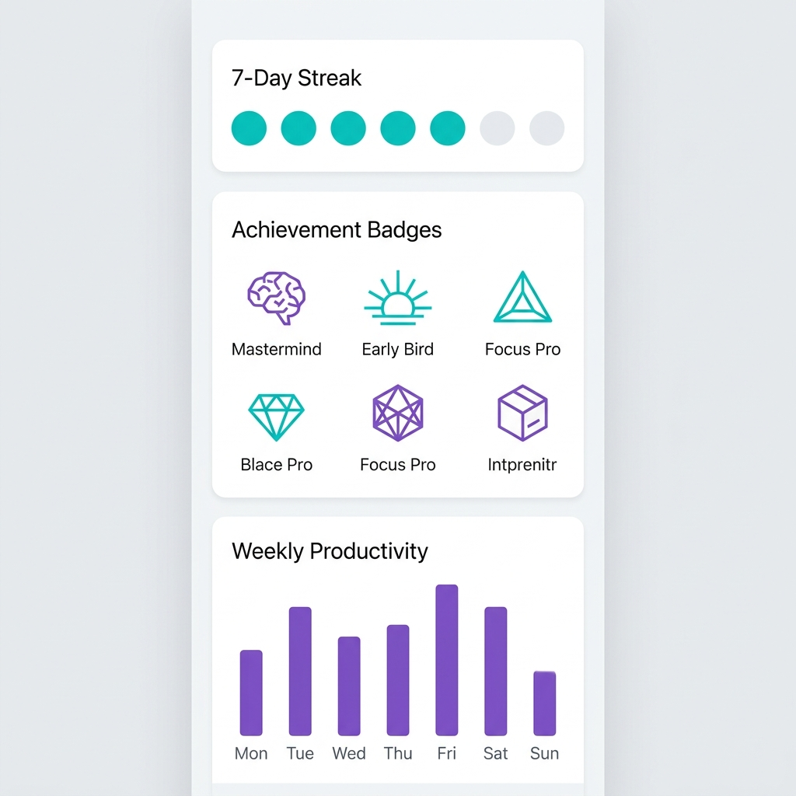

# Smart ToDo - Ultimate Productivity Companion



Smart ToDo is a premium, minimalist React Native application designed to help you stay organized, focused, and motivated. By combining powerful task management with a gamified experience and a scientific focus timer, it transforms your daily routine into a journey of achievements.

---

## 🚀 Features

### 📅 Smart Task Management
Organize your life with a sleek, card-based task list. Prioritize tasks with ease and watch your productivity soar.
- **Categorized Tasks**: High, Medium, and Low priority levels.
- **Visual Progress**: Real-time XP tracking and level-up system.
- **Minimalist Design**: Zero distractions, just pure focus.

### ⏱️ Pomodoro Focus Timer
Boost your concentration with our integrated focus timer. Designed to keep you in the zone using the Pomodoro technique.
- **Immersive Dark Mode**: A beautiful gradient-driven interface for deep work.
- **Customizable Intervals**: (Upcoming) Set your own work/break durations.
- **Streak Rewards**: Earn bonus XP by completing focus sessions.



### 🏆 Gamified Progress
Turn your productivity into a game. Earn XP for every completed task and unlock legendary badges.
- **Daily Streaks**: Stay active and maintain your streak to boost your score.
- **Achievement Badges**: Unlock 'First Step', 'Week Warrior', 'Legend', and more.
- **Weekly Analytics**: Visualize your performance with clean, interactive charts.



---

## 🛠️ Tech Stack

- **Framework**: [React Native](https://reactnative.dev/) with [Expo](https://expo.dev/)
- **Navigation**: [React Navigation](https://reactnavigation.org/)
- **State Management**: React Context API
- **Persistence**: [AsyncStorage](https://react-native-async-storage.github.io/async-storage/)
- **Styling**: Native StyleSheet with a custom dynamic Theme System (Light/Dark support)

---

## 📦 Installation

1. **Clone the repository**
   ```bash
   git clone https://github.com/AdVmmE/SuperTodolist-reactNative.git
   cd SuperTodolist-reactNative
   ```

2. **Install dependencies**
   ```bash
   npm install
   ```

3. **Start the application**
   ```bash
   npx expo start
   ```

---

## 📂 Project Structure

```text
src/
├── components/     # Reusable UI components (Cards, Badges, etc.)
├── context/        # Global state (Theme, Auth, data)
├── navigation/     # Navigation stacks and tab logic
├── screens/        # Main feature screens (Home, Timer, Stats)
├── services/       # External APIs and local storage logic
└── utils/          # Constants, themes, and helper functions
```

---

